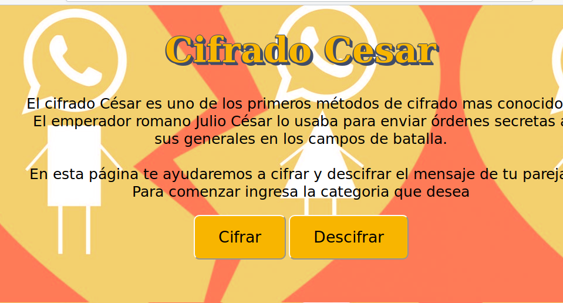
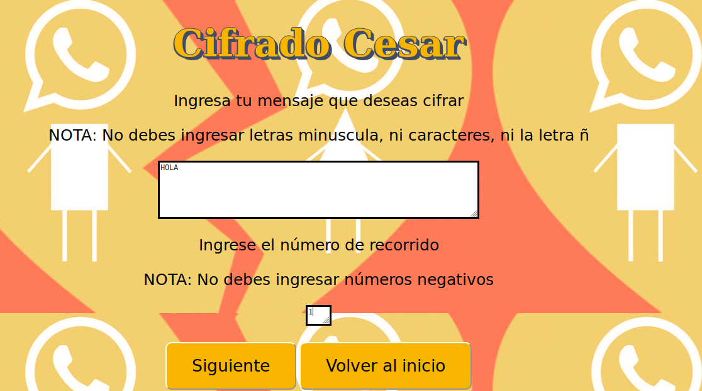
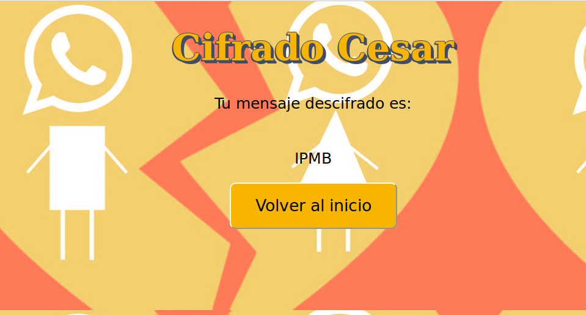

# Cifrado César

El cifrado César, también conocido como cifrado por desplazamiento, código de César o desplazamiento de César, es una de las técnicas de cifrado más simples y más usadas. Es un tipo de cifrado por sustitución en el que una letra en el texto original es reemplazada por otra letra que se encuentra un número fijo de posiciones más adelante en el alfabeto. Este método debe su nombre a Julio César, que lo usaba para comunicarse con sus generales.

.

El cifrado césar es una de las técnicas más faciles para cifrar un mensaje. Solo debes ingresar un desplazamiento, para saber cuantas posiciones a la derecha va correr. Para decodificar el mensaje el desplazamiento va para la izquierda.

Por ejemplo, si usamos un desplazamiento de 3 posiciones:

- La letra A se cifra como D.

En el siguiente ejemplo vamos a cifrar la palabra CASA con un desplazamiento de 2 posiciones

# Definición del producto

En la actualidad existe mucha desconfianza en las parejas, muchas veces queremos ocultar un mesaje que no queremos que nuestra pareja lea, ya sea una infidelidad, una sorpresa o simplemente no quieres que se entere de algo muy personal.

Este producto fue diseñado para poder codificar o descifrar esos mensajes que tanto te preocupa. Nos enfocamos solamente en personas con parejas sin importar la edad 

Si hablas con tus amigas por whatsapp  y quieres ocultar algo  a tu pareja aqui encontraras las herramientas indicadas para hacerlo. 

Imaginate que estas con el celular de tu pareja y encuentras varios mensajes con una amiga que no te dan confianza, aquí podrás ingresar el texto y decodificarlo para saber realmente cual es su significado. 

 Te damos la oportunidad de que tu ingreses un texto para codificar y decodificar con el desplazamiento que tu desea. 

# Diseño de Usuario

Nos enfocamos en diseñar una pagina facil y practica para el usuruio

- Pantalla principal

Seleccionamos como fondo un corazón roto, para que se identificara con nuestra pagina, ya que la persona cuando vio el resultado del mensaje no le gusto mucho, se le rompio el corazón.

Resaltamos el titulo con un tipo de letra con relleno , para que el usuario no tenga problema de visualización. 

Dimos una pequeña reseña para que supieran de donde viene el cifrado cesar. Con una letra grande y negra para no cansar la vista del usuario.

Colocamos dos bonotes donde el usuario selecciona la categoría que desea. Son botones grande para que no tengan dificultad de ver.

 - Pantalla secundaria

 

En esta pantalla nos enfocamos en dejarle muy claro al usuario de como debe ingresar el texto. Se pide que ingrese el texto pero tiene una condición que debe cumplir, luego se le pide el numero de recorrido que también tiene una condición especial. 

Tiene dos botones donde le damos la oportunidad de seguir o regresar a la pagina de inicio. Si el usuario se equivoco de categoría solo presiona el botón de volver  

- Pantalla Final
 
 

En la ultima pantalla ya le mostramos al usuario el resultado de su mensaje codificado o descodificado, le damos la opción  de volver al inicio.

Nos enfocamos de que nuestra pagina fuera breve y precisa, para que el usuario no tuviera problemas en entender. Dejamos las reglas claras, si el las rompe le saldrá un mensaje de que algo esta haciendo mal.

